# Splash Screen  

Merubah tampilan awal device saat baru dinyalakan, yang biasanya kalo kita menyalakan device maka akan menampilkan logo Xiaomi.  
Nah itu bisa dimodifikasi dengan gambar kita sendiri menggunakan Splash Creator ini.  
Dan ini beda dengan Boot Animation.

{: .note }
> Khusus untuk device Redmi Note 10 Pro / Pro Max `(sweet / sweetin)`.
>
> Device harus sudah terinstall Custom Recovery `(TWRP / OrangeFox)`.  

Jika kamu ingin membuat sendiri bisa menggunakan Tools ini:  

[Splash Screen Creator](https://drive.google.com/file/d/1GcYzfYFChgWrM2XLX75h1ViaUTdpAvP1/view?usp=sharing){: .btn }
  

Atau jika kamu mau yang sudah jadi, saya ada beberapa koleksi Splash Screen yang saya buat, bisa kamu pilih dan download:  

[Splash Screen Redmi Note 10 Pro](https://t.me/faultx003/184){: .btn }
  

### Cara install

Sudah terinstall [Custom Recovery](../4-recovery/index.md)  
- Download file (`.zip`)
- Reboot ke Recovery
- Pilih file yang sudah kamu download tadi
- Lalu kamu Flash
- Reboot
- Done  

Saat rebooting, otomatis Logo awal (_splash screen_)akan berubah.

Jika kamu butuh **Stock MIUI Splash** atau mengembalikanya bisa kamu download dan cara installnya sama seperti diatas. 

[Stock Splash - Redmi Note 10 Pro](../assets/splash/flashable_splash_MIUI-13-14-faultx.zip){: .btn }
  

---

# 📸

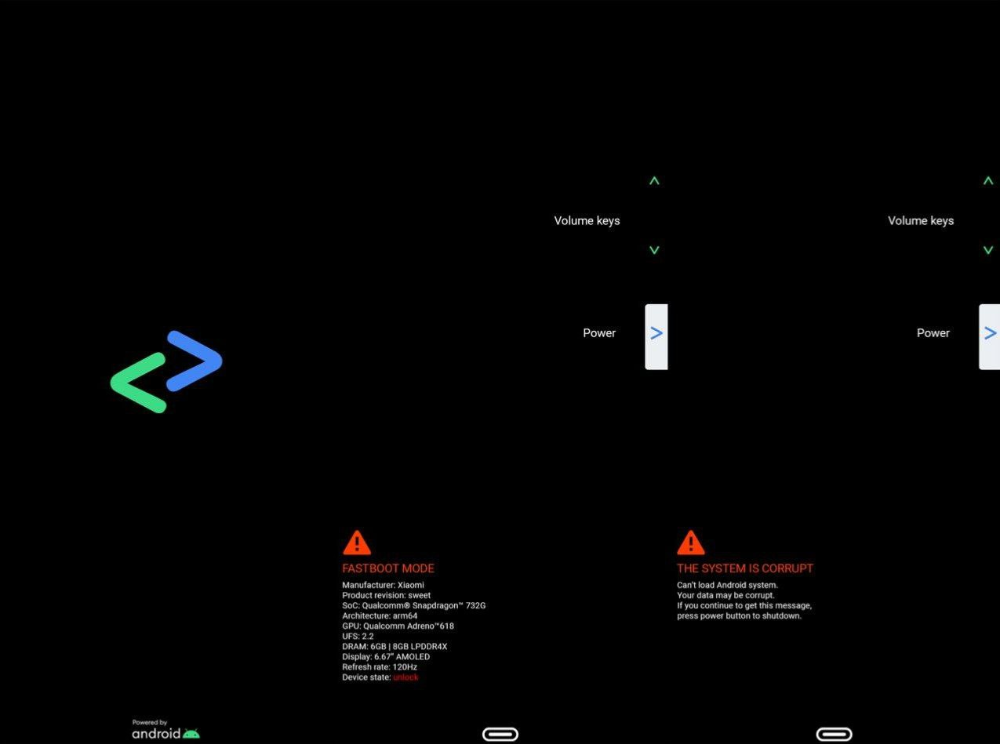
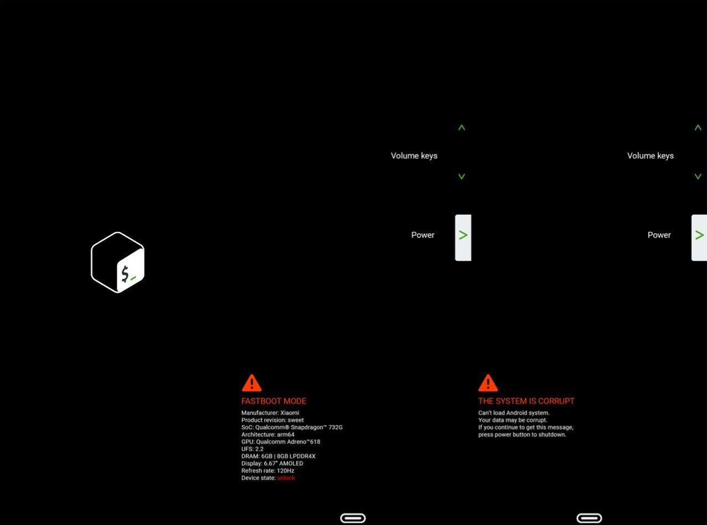
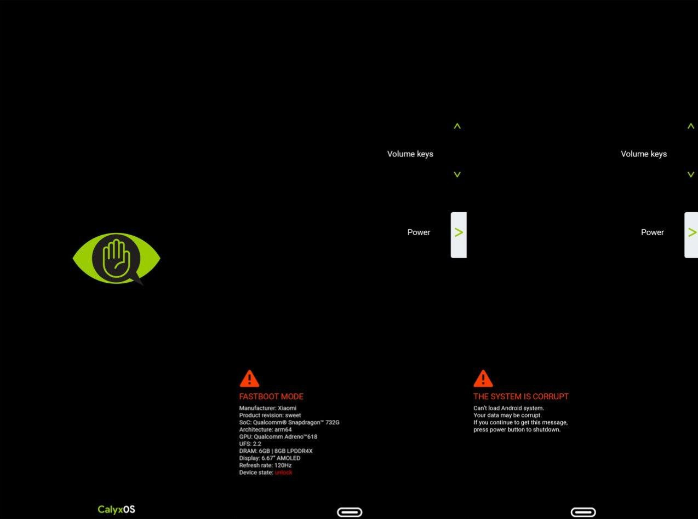
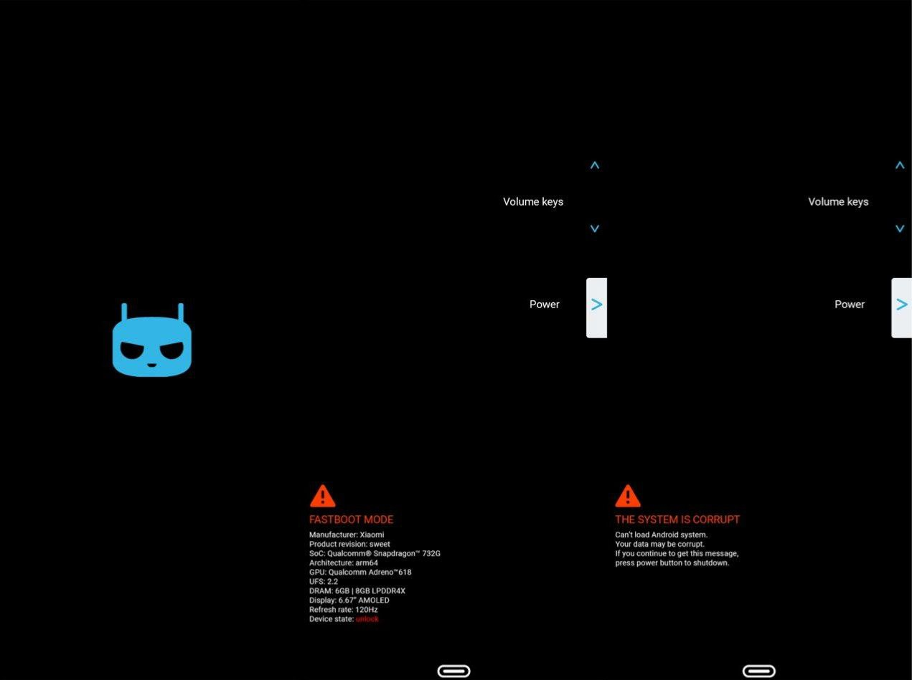
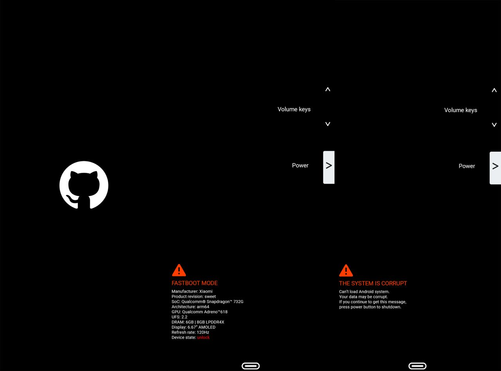
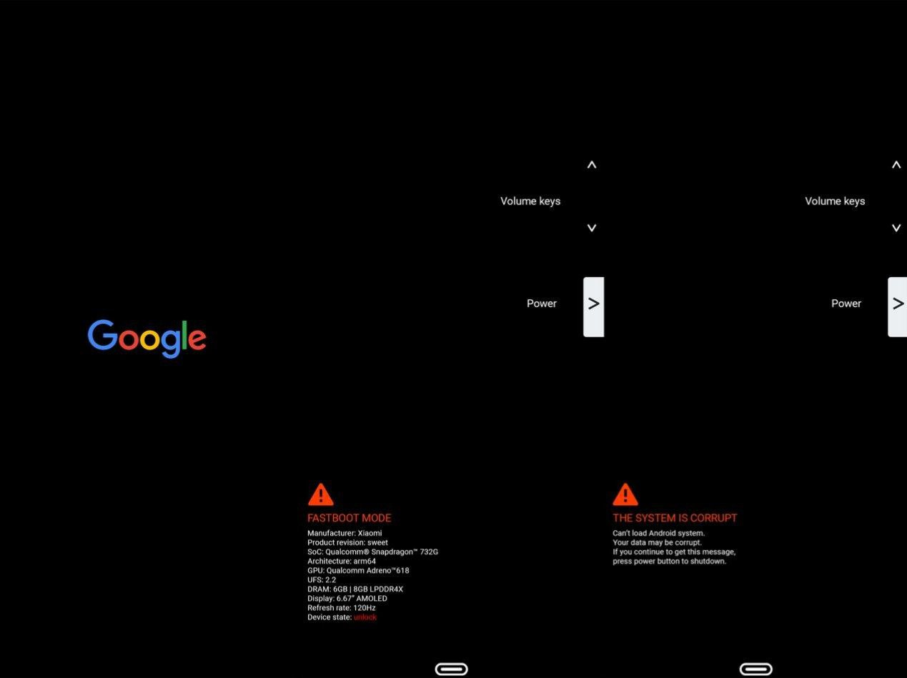

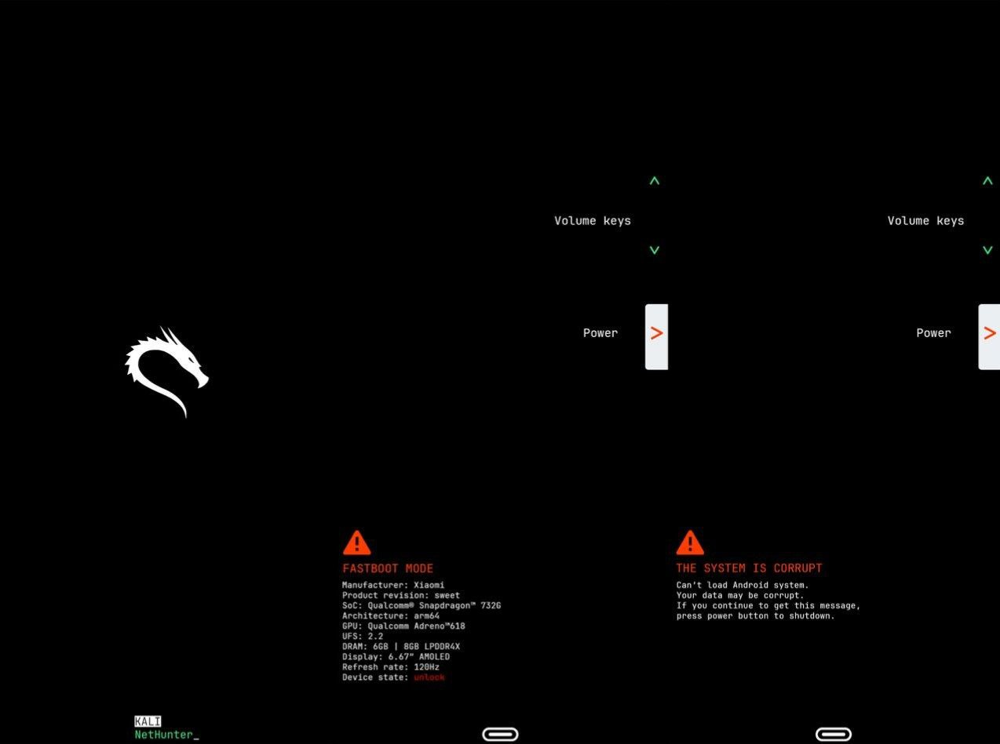
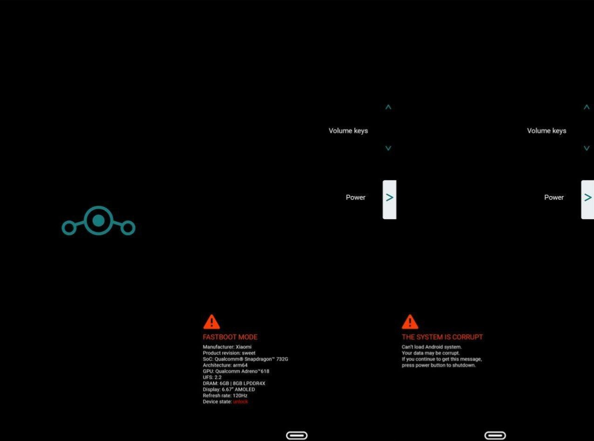
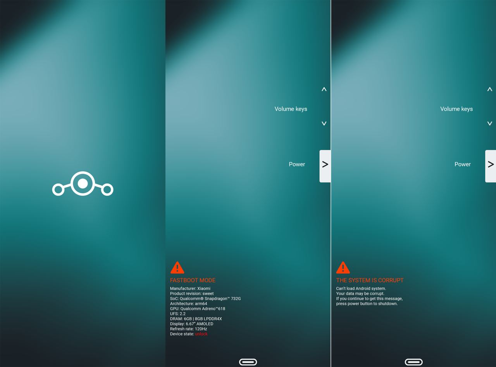
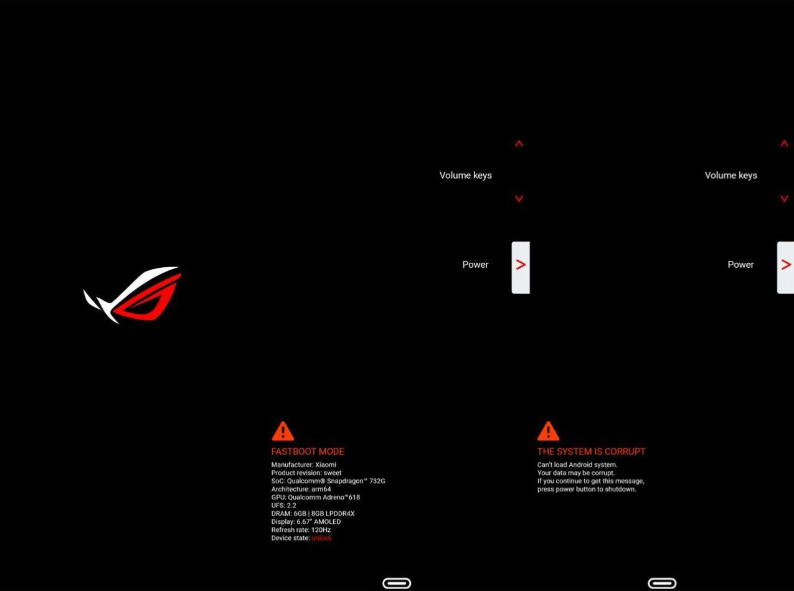
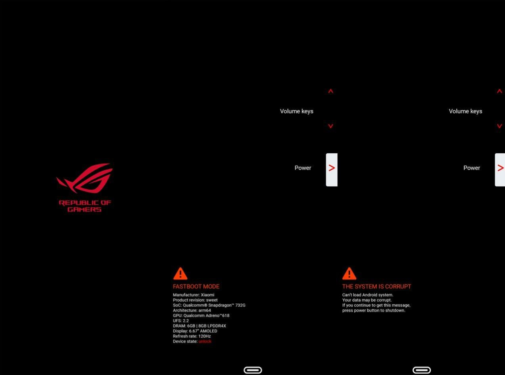
