# Install adb & fastboot Driver

{: .note }
> Attention to the installation steps properly

### Step 1  

Download & extract:
  
  - [ADB (Windows)](https://cloud03.faultx.workers.dev/1:/ADB%20Fastboot/adb-setup-1.4.3.zip?a=view)
  - [Mi Unlock Tools](https://cloud03.faultx.workers.dev/1:/Mi%20Unlock/miflash_unlock_en_7.6.727.43.zip?a=view)

  

    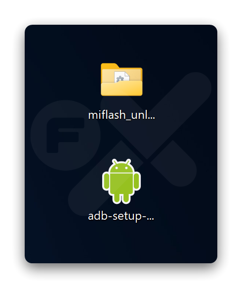
  

### Step 2
  
Double click ➜ `adb-setup-1.4.3.exe`  
Then press the key ➜ **Y**  
_See the image below_
  

    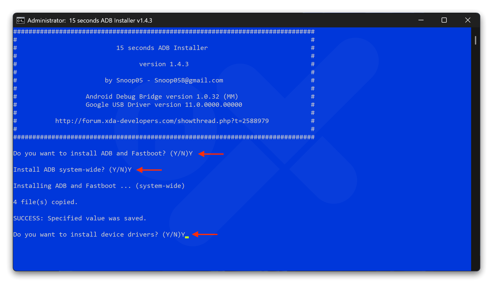
  

### Step 3
Make sure ➜ ☑️ _Always trust software from "Gooogle Inc"_ , Then click **"Install"**
  

    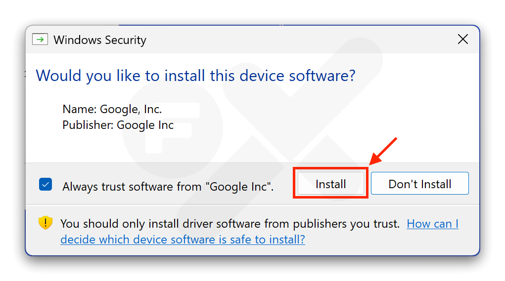
  

### Step 4
Click ➜ **Next**
  

    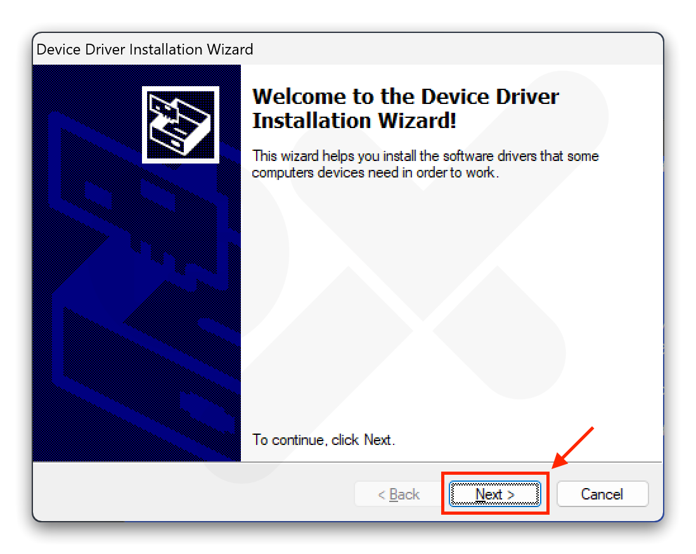
  

### Step 5
The message "Ready to use" will appear.
Click **"Finish"** 
  

    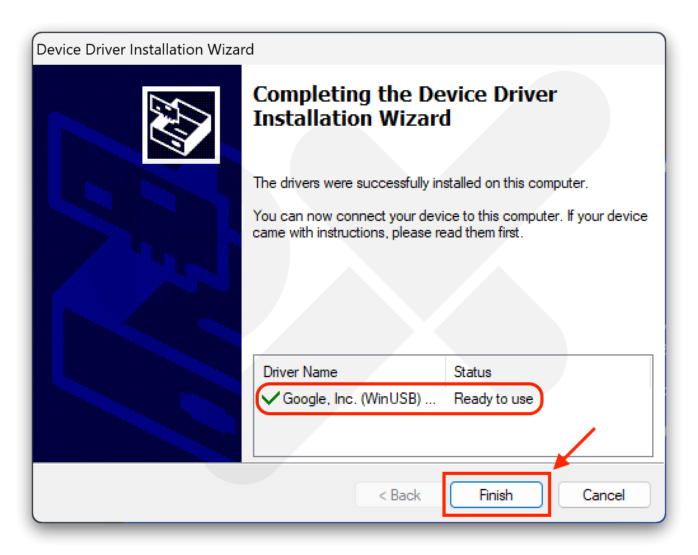
  

### Step 6
Double click `miflash_unlock.exe`
  

    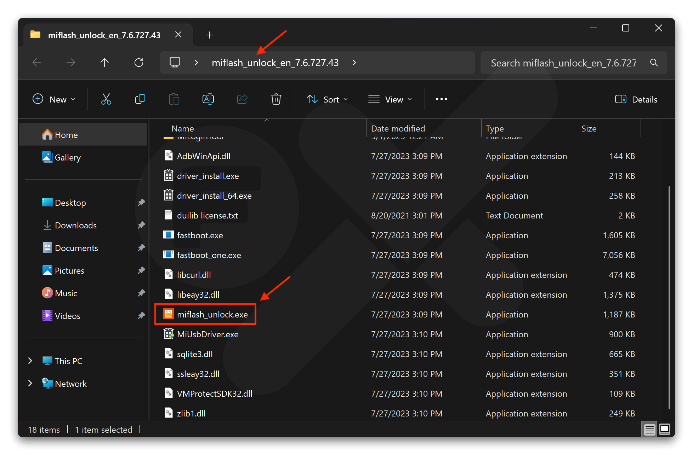
  

### Step 7

  

    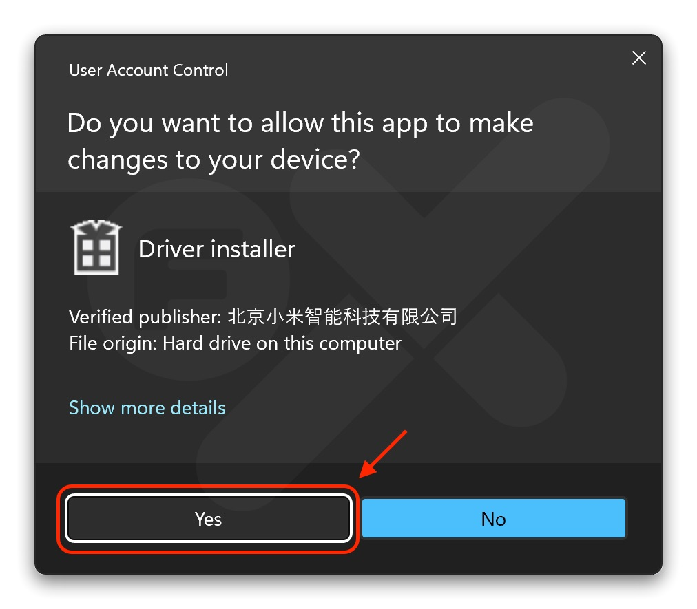
  

### Step 8
Click the **"Gear"** icon (see the red circle)
  

    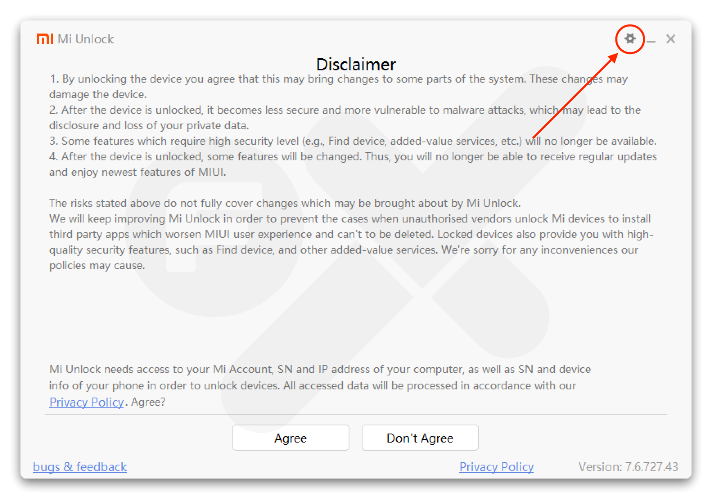
  

### Step 9
- Open **Device Manager** (Click the **Start** button (Windows logo) ➜ Type **Device Manager** in the search bar ➜ Click on the **Device Manager** result)
- Connect your device to the computer via USB cable
- If Device Manager shows **`⚠︎ Android`** it means the fastboot driver has not been installed correctly
- Click ➜ **Check** _"Click the button to install drive"_
  

    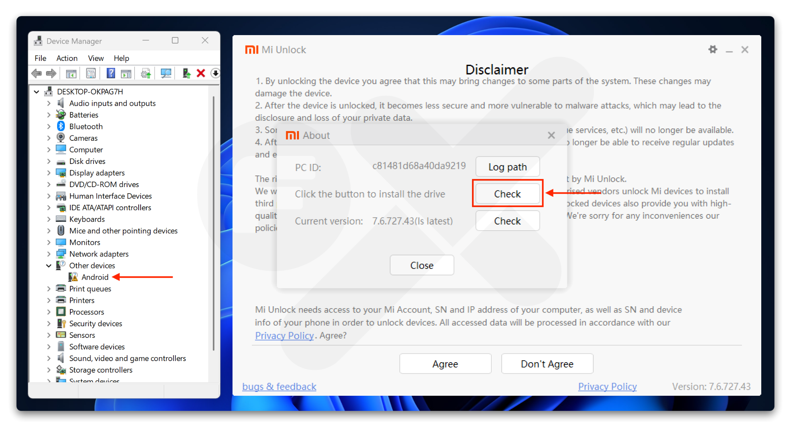
  

### Step 10
- If it says **"Connect your device again"**, unplug the USB and reconnect your device to the computer
- The driver should then install automatically
  

    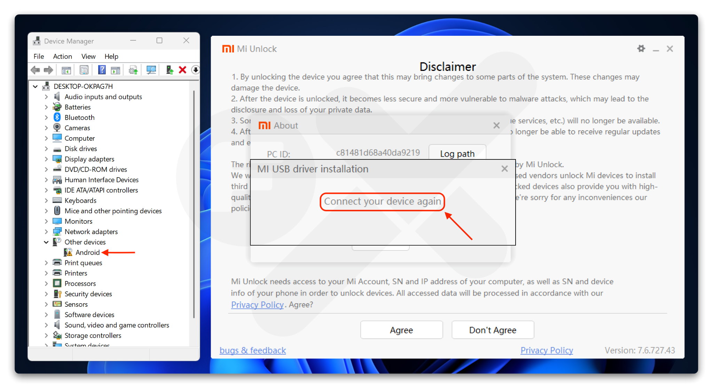
  

### Step 11
If the installation is successful, the display will look like the image below.  

Then **Close** `Mi Unlock`.
  

    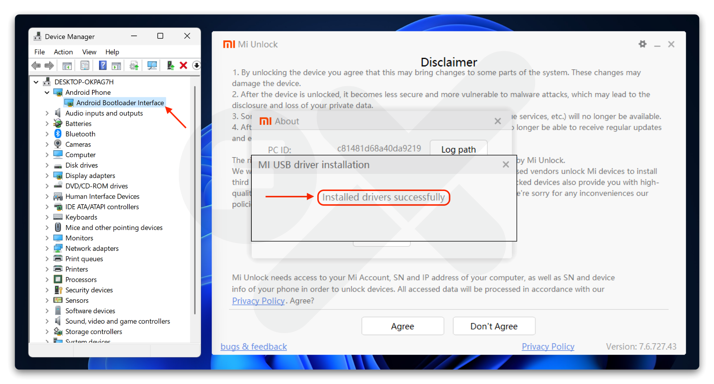
  

### Step 12
- Open Terminal / CMD
- Type the command: `fastboot devices`  

If the result looks like this, you're done 🎉.
  

    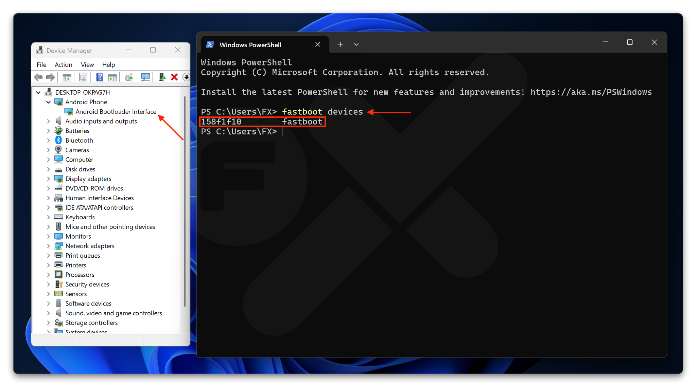
  

