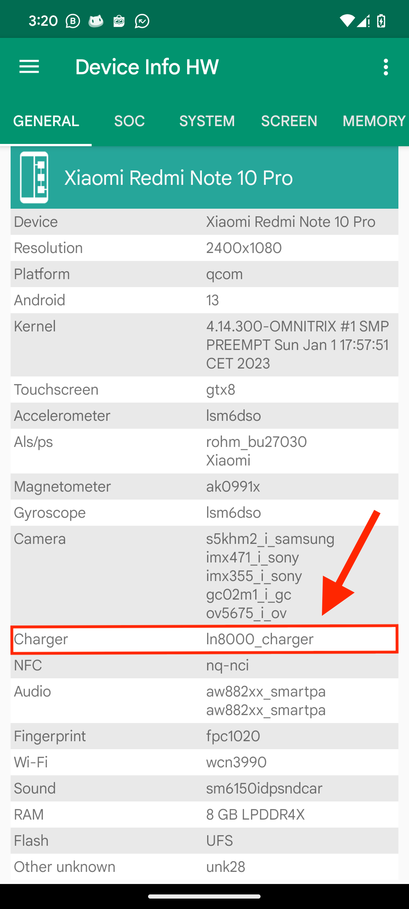

# Charging issues

Di beberapa device Redmi Note 10 Pro yang menggunakan Custom ROM base AOSP / non-MIUI ada issues saat charging yang lambat, itu dikarenakan **Charging IC** yang digunakan, terutama jika perangkat Anda menggunakan IC pengisian daya **`LN8000`**.  

### Detail Isu LN8000

- **Varian IC:** Redmi Note 10 Pro `(codename: sweet / sweetin)` dilaporkan memiliki dua jenis IC pengisian daya (Charging IC) yang berbeda yang digunakan oleh Xiaomi:

    - **`BQ2597x`** (atau yang serupa).

    - **`LN8000`**.  

- **Ketersediaan Driver:** Isu utama terletak pada driver untuk `IC LN8000 `di Kernel Custom ROM. Driver untuk `IC LN8000` ini dilaporkan <ins>belum dirilis ke publik</ins> (atau sulit diimplementasikan) oleh Xiaomi.

- **Dampaknya pada Custom ROM:**  
    - Custom ROM (terutama yang berbasis AOSP - _Android Open Source Project_) seringkali tidak memiliki driver yang tepat untuk `LN8000`.

    - Akibatnya, fitur **Fast Charging (33W)** tidak berfungsi atau perangkat hanya akan mengisi daya pada kecepatan **standar/lambat (sekitar 10-15W)**.

- **Solusi Sementara:**  
    - **Ganti Kernel:** Beberapa pengguna berhasil memperbaiki masalah ini dengan memasang Custom Kernel yang secara spesifik telah dimodifikasi atau menyertakan patch untuk driver pengisian daya `LN8000` (contoh: Sleepy Kernel atau Vantom Kernel, tergantung ketersediaan dan dukungan).

    - **Ganti Custom ROM:** Beberapa Custom ROM yang berbasis MIUI (seperti **Xiaomi.eu**) atau ROM AOSP tertentu yang secara aktif dikelola oleh developer mungkin sudah menyertakan perbaikan untuk masalah ini, namun ini bervariasi dari waktu ke waktu.

    - **Kembali ke MIUI:** Menggunakan Firmware/ROM resmi MIUI biasanya menyelesaikan masalah ini, karena MIUI sudah memiliki driver yang tepat dari pabrikan.

## Bagaimana Cara Mengetahui IC Charger?  

Cara untuk mengetahui IC charger mana yang dimiliki perangkat kamu adalah menggunakan aplikasi **Device info HW**  

[Download](https://play.google.com/store/apps/details?id=ru.andr7e.deviceinfohw&hl=en&gl=US){: .btn }
  

Setelah kamu install dan buka aplikasinya, perhatikan gamabar dibawah ini:
  

Perhatikan tanda panah merah, menunjukan: **`ln8000_charger`**.  

Jika sebelumnya di MIUI tertera `ln8000_charger` lalu setelah coba rom AOSP berubah menjadi `USE PMIC`, maka fast-charging  tidak bekerja.  

Jika yang tertera `BQxxxx` berarti device kamu menggunakan Charging IC: `BQxxxx`.  