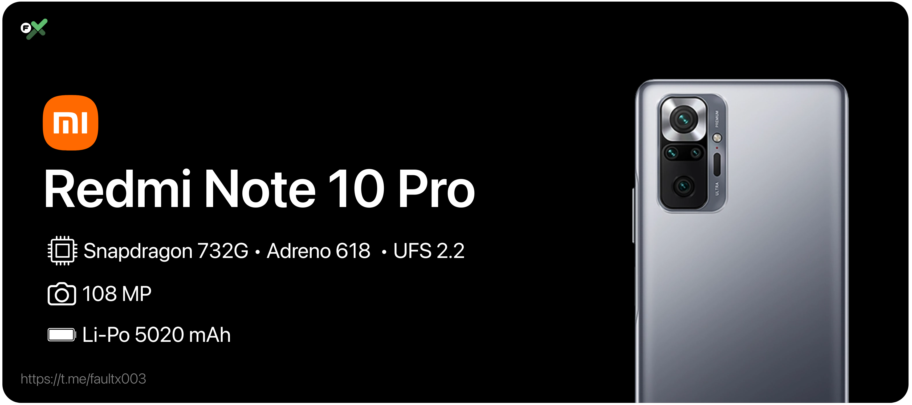

# Informasi Perangkat

|  | Spesification |
|:---|:---|
|Codename | sweet / sweetin |
| SoC | Qualcomm SM7150-AC Snapdragon 732G |
| RAM | 6/8 GB |
| CPU | Octa-core Kryo 470 2 x  2.3 GHz + 6 x 1.8 GHz |
| Architecture | arm64 |
| GPU | Qualcomm Adreno 618 |
| Network | 2G GSM, 2G CDMA, 3G UMTS, 4G LTE |
| Storage | 64/128/256 GB, UFS 2.2 |
| SD card	| Up to 512 GB |
| Screen | 6.67 in (169.42 mm), 2400x1080 (394 PPI), AMOLED (max. 120 Hz) |
| Bluetooth | 5.1 with A2DP + aptX HD |
| Wi-Fi | 802.11 a/b/g/n/ac |
| Peripherals | 3.5mm jack, A-GPS, Accelerometer, Compass, Dual SIM, FM radio, Fingerprint reader, BeiDou, Galileo, GLONASS, GPS, Gyroscope, IR blaster, Light sensor, NFC, Ultrasound, proximity sensor, USB OTG |
| Cameras | 108 MP, LED flash, 8 MP (ultrawide) LED flash, 5 MP (macro) LED flash, 2 MP (depth) LED flash, 16 MP, No flash |
| Dimensions | 164 mm (6.46 in) (h), 76.5 mm (3.01 in) (w), 8.1 mm (0.32 in) (d) |
| Battery | Non-removable Li-Po 5020 mAh |
