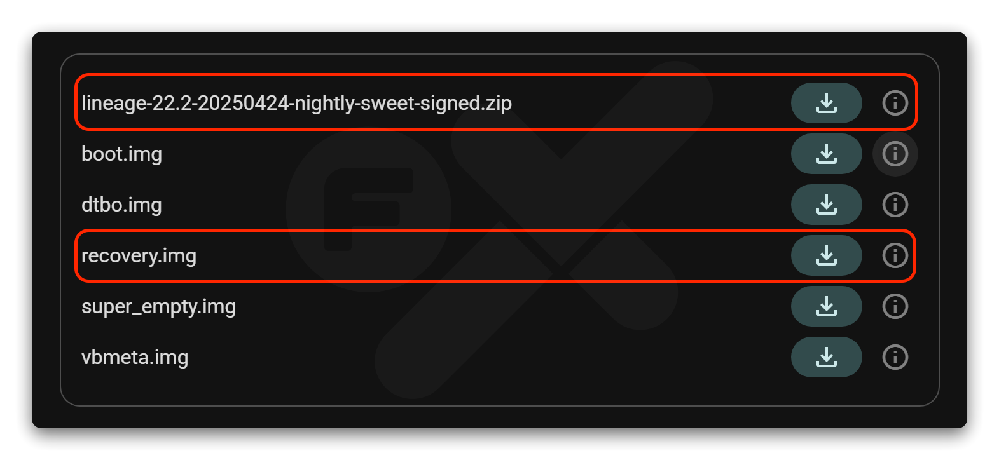
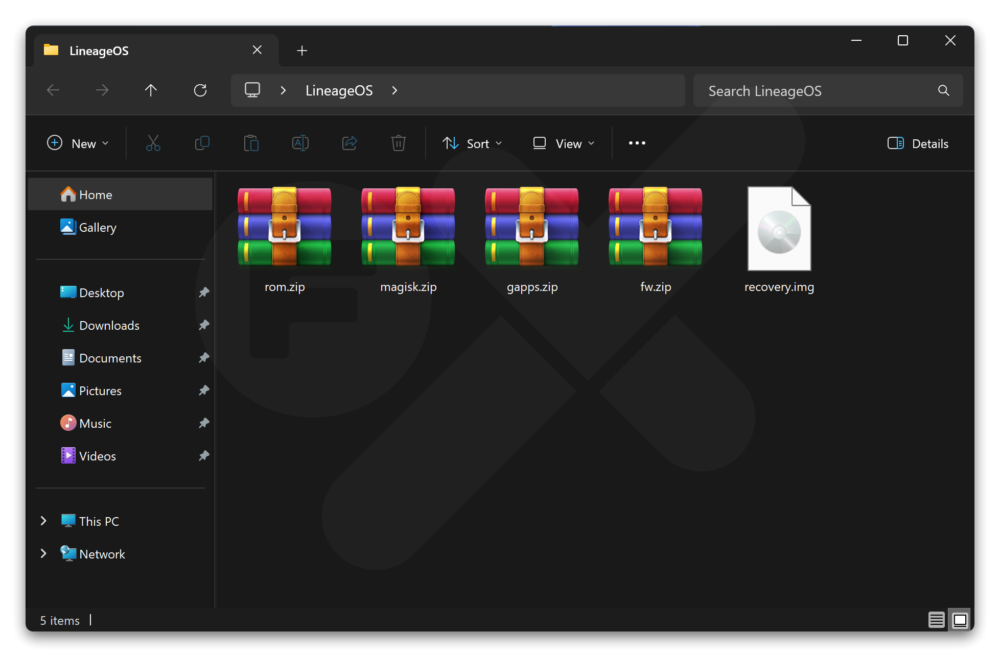
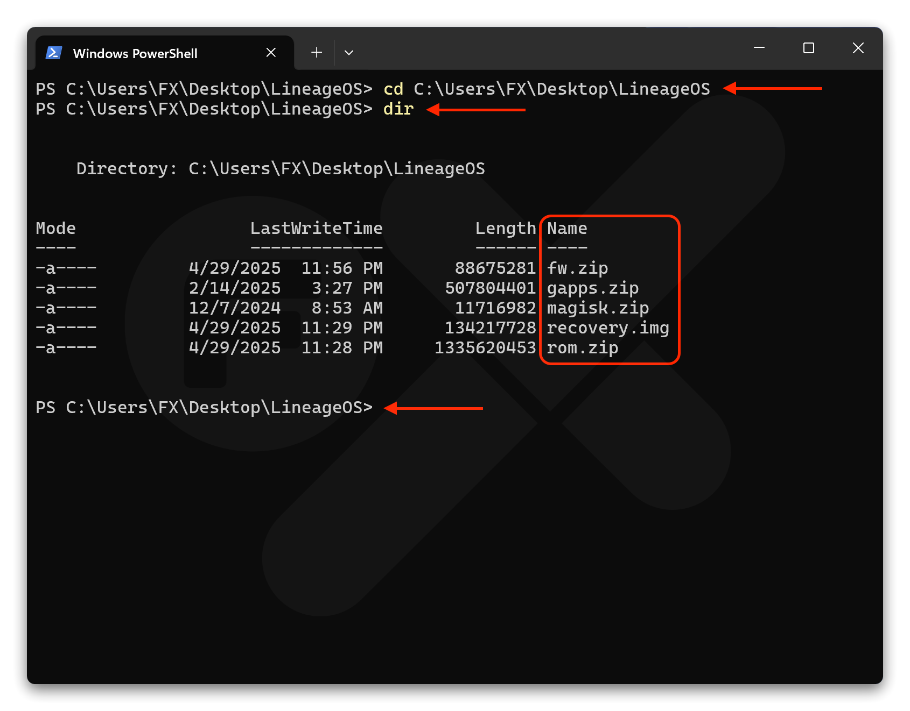
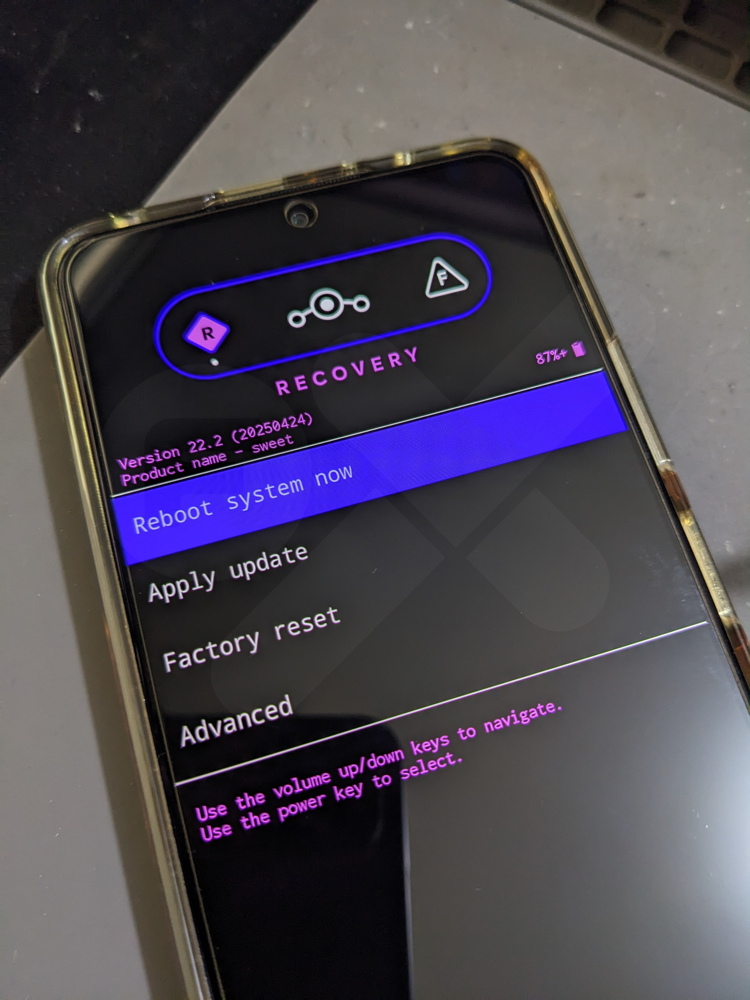
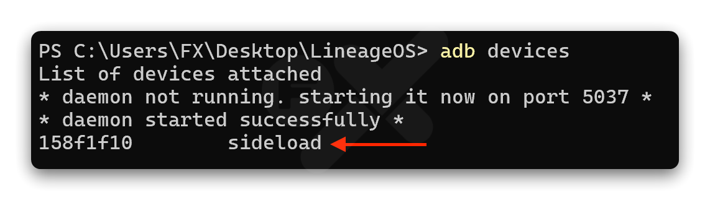
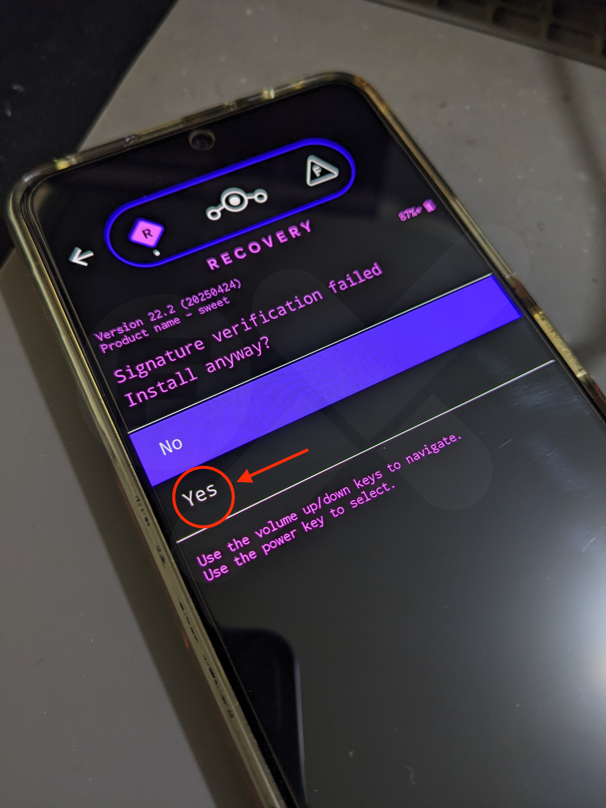

# LineageOS
LineageOS adalah custom ROM open‑source yang dikenal karena stabilitas, keamanan, dan kesederhanaannya. ROM ini menawarkan pengalaman Android murni (AOSP) tanpa bloatware, dengan penekanan pada privasi dan kinerja yang konsisten.  

Untuk Redmi Note 10 Pro, LineageOS menjadi pilihan populer karena:  
- Ringan, stabil, dan cocok untuk penggunaan harian
- Tidak ada aplikasi bawaan yang tidak diperlukan
- Fokus pada privasi dengan fitur seperti LineageOS Privacy Guard / Permission Hub
- Dukungan komunitas besar dan update rutin  

LineageOS sangat cocok bagi pengguna yang mencari pengalaman Android bersih, stabil, dan terpercaya tanpa modifikasi berlebihan.

---


# Install LineageOS

```
Device   : Redmi Note 10 Pro
codename : sweet
```
➜ [Official guide](https://wiki.lineageos.org/devices/sweet/install/variant1/#)

---

## Download
- [LineageOS ROM & Recovery](https://download.lineageos.org/devices/sweet/builds)
  

    
   Rename:
  - `lineage-xx.x-xxxx-nightly-sweet-signed.zip` ➜ `rom.zip`
    
- [Latest Firmware Only](../rom/firmware.md)

  Rename: `fw_sweet_miui_xxxxx_13.0.zip` ➜ `fw.zip`
- Optional:
  - [MindTheGApps](../rom/gapps.md)

    Rename: `MindTheGapps-15.0.0-arm64-xxxxx.zip` ➜ `gapps.zip`
  - [Magisk](https://github.com/topjohnwu/Magisk/releases)

    Rename: `Magisk-xxxx.apk` ➜ `magisk.zip`

### Syarat
- Pastikan [ADB & Fastboot Driver](../tools/adb-fastboot.md) sudah terinstall dengan benar di mesin komputer anda.
- Backup semua data penting, karena data akan terformat.
- **Sign out** Mi Account, Jika anda saat ini di MIUI ROM.
- **Sign out** semua akun Google untuk menghindari "FRP" (Factory Reset Protection).

## Sebelum memulai Flash LineageOS

1. Pastikan semua syarat diatas sudah terpenuhi, dan semua file yang sudah di download simpan dalam 1 folder, contoh nama folder "LineageOS".


2. Buka Terminal/CMD, arahkan folder yang tadi kita buat "LineageOS" ke Terminal/CMD.
   - Ketikan perintah: **`cd`** spasi lalu drag & drop folder **LineageOS** ke Terminal/CMD lalu Enter
   - Ketikan **`dir`** Enter


     Jika sudah seperti gambar (contoh) dibawah ini, maka lanjut ke step berikutnya
     
3. Jika sudah dipastikan sesuai, lanjut untuk step berikutnya.

## Flash ROM

Teliti dan pahami step berikut:
  
  1. Matikan device kamu
  2. Tekan dan tahan tombol **`Power`** + **`Volume Bawah`** sampai adan keterangan **"FASTBOOT"**, lalu hubungkan device ke komputer dengan kabel USB.
  3. Copy - Paste command:
     ```
     fastboot devices
     ```
     Pastikan `Device ID` muncul.
  4. Install Recovery (`recovery.img`)
     Copy - Paste command:
     ```
     fastboot flash recovery recovery.img
     ```
     Tunggu sampai proses install recovery selesai dengan tulisan **"Done"**.
  5. Reboot device ke Recovery Mode
     Tekan dan tahan tombol **`Power` + `Volume Atas`**. Saat Logo "MI" muncul langsung lepaskan tombol **`Power`**.
     

  6. Pilih **`Apply update`** ➜ **`Apply from ADB`**
  7. Cek untuk memastikan ADB Sideload terdeteksi di komputer:
     ```
     adb devices
     ```
     Pastikan kembali jika berhasil terdeteksi akan seperti ini:
     ```
     List of devices attached
     fe4afbea        sideload ← terdeteksi
     ```
     

     
  8. Install Firmware:
     ```
     adb -d sideload fw.zip
     ```
     Tunggu proses install firmware berjalan, nanti akan muncul keterangan:
     ```
     Signature verification failed
     Install anyway?
     ```
     Pilih: ➜ **YES**

     

     Proses akan dilanjutkan kembali, dan jika sudah selesai proses install firmware otomatis akan kembali ke menu utama recovery.
10. Pilih **`Advanced`** ➜ **`Reboot to recovery`**.
11. Pilih **`Factory reset`** ➜ **`Format data/factory reset`** ➜ **`Format data`**.  
12. Jika proses Format data selesai, kembali ke menu utama recovery dengan menekan **`←`** yang ada di pojok kiri atas.
13. Pilih **`Apply update`** ➜ **`Apply from ADB`**
14. Kembali ke Terminal/CMD lalu install ROM:
    ```
    adb -d sideload rom.zip
    ```
    Tunggu & pastikan keterangan yang ada di device seperti:
    `Install completed with status 0`
    
    Proses install rom LineageOS **sudah berhasil dan selesai**.
15. Pilih **`Reboot system now`** untuk booting ke LineageOS.

    Jika kamu ingin melakukan install GApps, **Jangan untuk `Reboot system now` tapi lanjut ke step berikutnya**.
16. Kembali ke Terminal/CMD
17. Install GApps

    Di Recovery pilih **`Apply update`** ➜ **`Apply from ADB`**
    ```
    adb -d sideload gapps.zip
    ```
    Tunggu proses install GApps berjalan, nanti akan muncul keterangan:
    ```
    Signature verification failed
    Install anyway?
    ```
    Pilih: **`YES`**

    Proses akan dilanjutkan kembali, dan jika sudah selesai proses install GApps otomatis akan kembali ke menu utama recovery.
18. Pilih **`Factory reset`** ➜ **`Format data/factory reset`** ➜ **`Format data`**.
19. Jika proses Format data selesai, kembali ke menu utama recovery dengan menekan **`←`** yang ada di pojok kiri atas.
20. Pilih **`Reboot system now`** untuk booting ke LineageOS.
21. Selesai!

## Root menggunakan Magisk (Optional)
- Reboot ke Recovery Mode
- Di Recovery pilih **`Apply update`** ➜ **`Apply from ADB`**
  ```
  adb -d sideload magisk.zip
  ```
  Tunggu proses install Magisk berjalan, nanti akan muncul keterangan:
  ```
  Signature verification failed
  Install anyway?
  ```
  Pilih: **`YES`**

  Proses akan dilanjutkan kembali, dan jika sudah selesai proses install otomatis akan kembali ke menu utama recovery.
- Pilih **`Reboot system now`** untuk booting ke LineageOS.
- Jika sudah masuk home screen, buka Magisk dan ikutin step2 dari magisk
- Selesai!

---

Command Line untuk yang sudah paham atau yang sudah terbiasa install custom rom via sideload, ini command untuk install
<details>
  <summary>Open</summary>
 
 
  ```
  adb reboot bootloader
  ```
  ```
  fastboot flash recovery recovery.img
  ```
  ```
  fastboot reboot-recovery
  ```
  ```
  adb -d sideload fw.zip
  ```
  ```
  adb -d sideload rom.zip
  ```
  ```
  adb -d sideload gapps.zip
  ```
  ```
  adb -d sideload magisk.zip
  ```
 </details>
