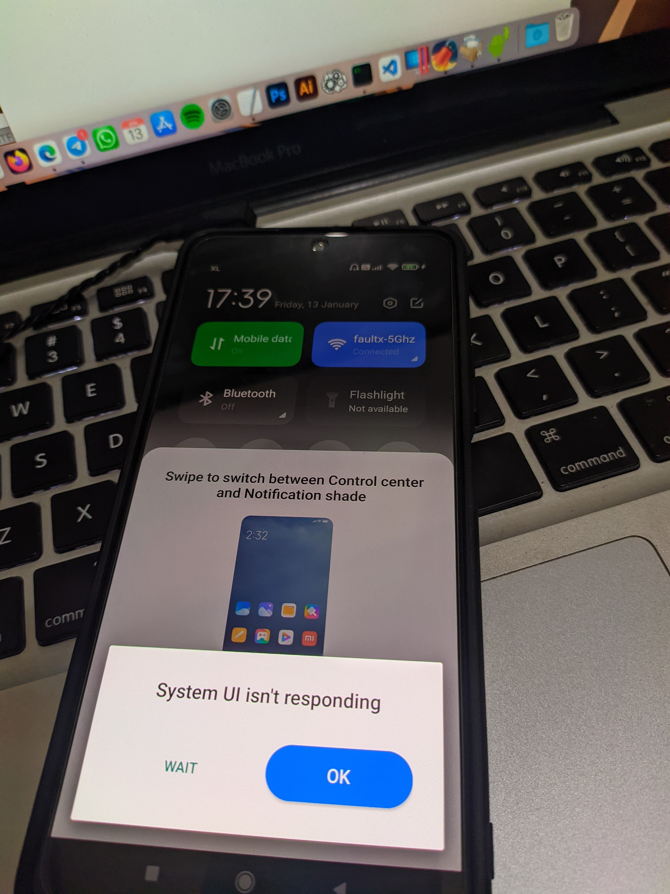
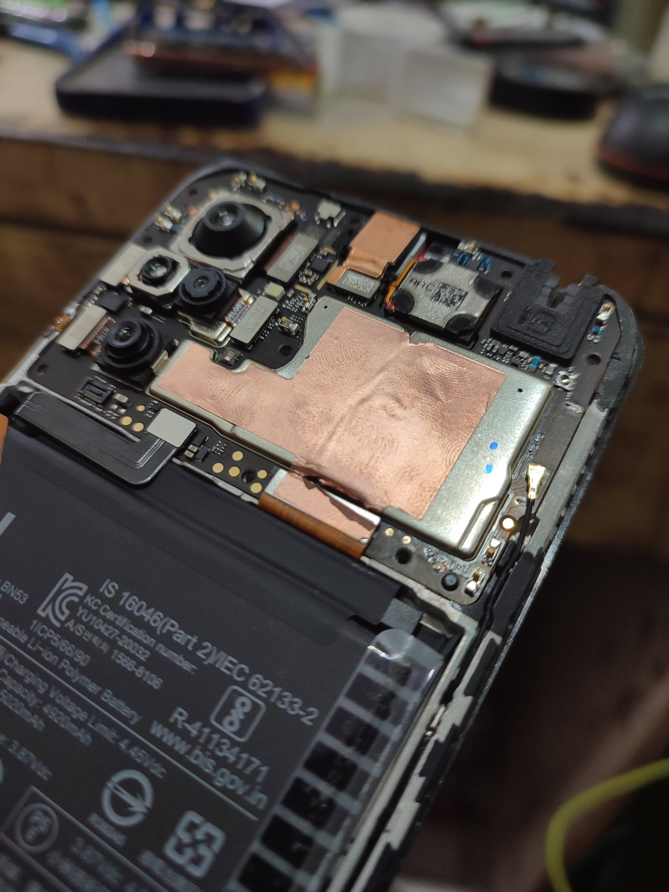
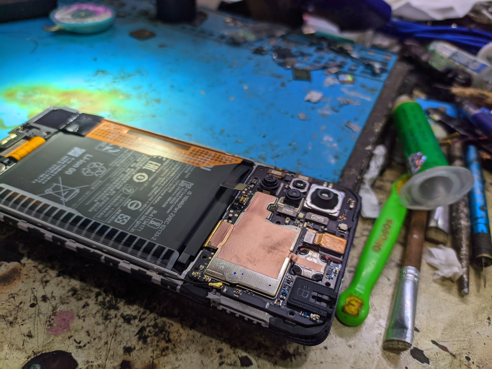
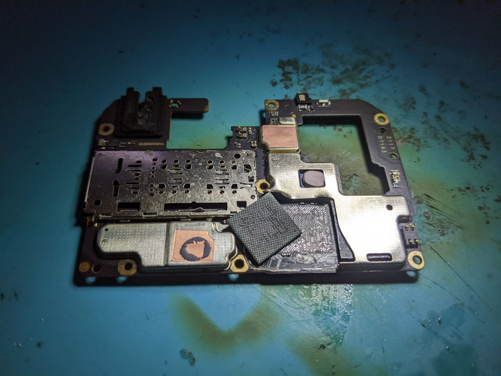
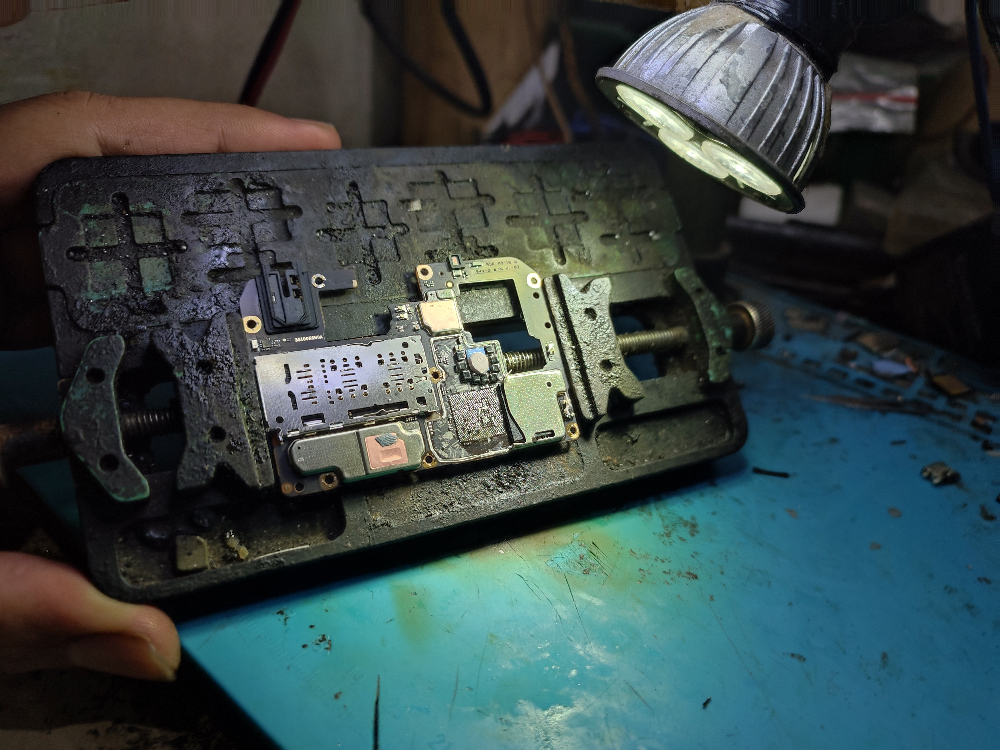
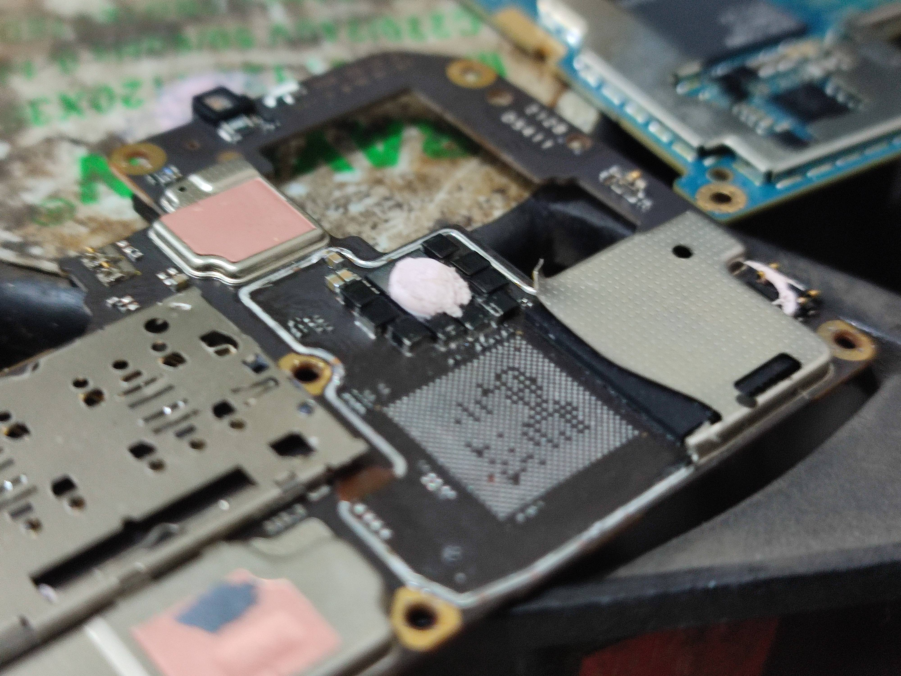
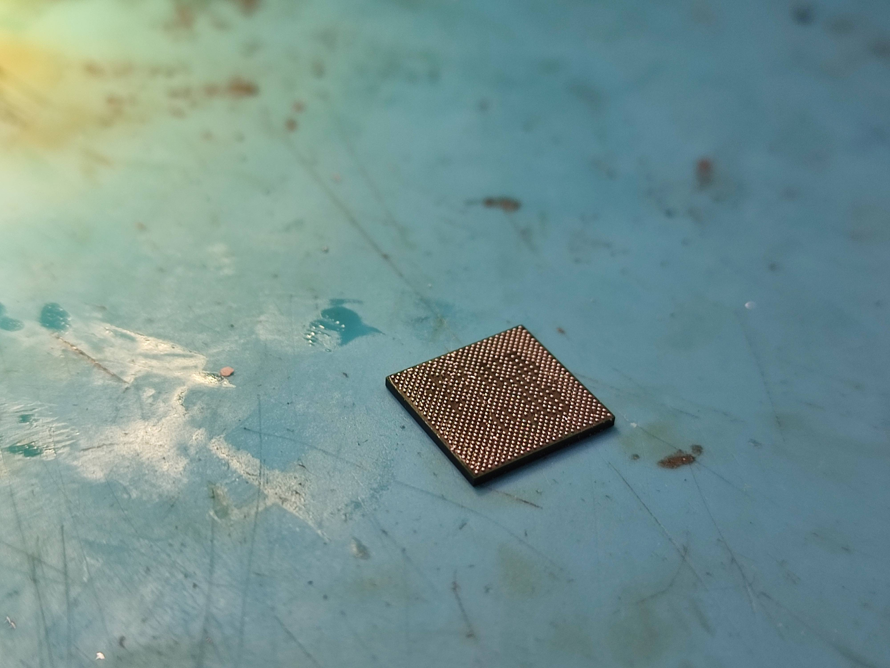

# Hardware issues

Beberapa member (sweet device) pm dan tag saya di grup,   
Mendapatkan keluhan di device dengan gejala:

- Audio (speaker & headset) tidak berfungsi
- System UI isn't responding
- Perekam video tidak berfungsi
- Tapi kamera depan & belakang berfungsi normal
- Tidak bisa membuka / Force Close **"sound effects"**  
(Settings ➜ Sound & Vibration ➜ Sound Effects)
- Banyak hal yang malfungsi

Singkatnya ini masalah di chipset CPU,

### Solusi

1. **Reballing chipset CPU**  
Datanglah ke tempat service/repair terpercaya untuk di cek ulang.  
Untuk biaya sangat varian (estimasi): `Rp 400,000 - Rp 1,000,000 ` dan ini tergantung lokasi.

2. **Ganti Mainboard**  
Ya, cara mudah tapi mahal ganti mainboard.  
bisa cek harga resmi (jika masih ada)  [Cek Part](https://www.mi.co.id/id/support/spare-parts-price/?name=redmi-note-10-pro m){: .btn .btn-purple }

---

### 📷 Dokumentasi saat saya reballing chipset CPU

---

[source](https://telegra.ph/Redmi-Note-10-Pro-Hardware-IssuesHW-Issues-01-15)
