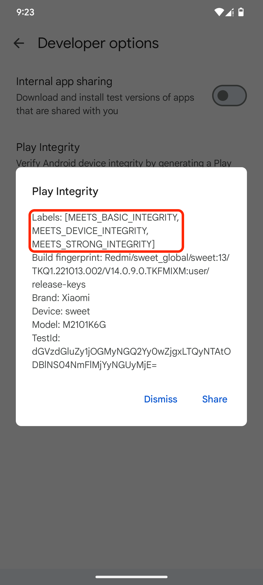

# Play Integrity

### 🔐 Apa Itu Play Integrity?
**Play Integrity** adalah API dari Google Play Store / Google Play Services yang membantu pengembang aplikasi memverifikasi:
Apakah aplikasi yang dijalankan adalah versi resmi dari Play Store,
Apakah perangkatnya bersertifikasi & belum dimodifikasi (root/unlock bootloader),
Apakah instalasi dilakukan melalui channel resmi. 

### ✅ Fungsi Utama
Dengan Play Integrity, aplikasi dapat mendeteksi hal-hal seperti:
Aplikasi yang telah dimodifikasi atau dibajak (appIntegrity)
Perangkat yang tidak bersertifikasi atau telah di-root (deviceIntegrity)
Instalasi yang tidak sah (accountDetails). 

### ⚠️ Kenapa Ini Penting?
Banyak aplikasi — terutama perbankan, game, dan layanan digital — mengandalkan Play Integrity untuk memastikan pengalaman dan keamanan pengguna tetap terjaga.
Jika perangkat tidak “lolos” verifikasi, maka layanan bisa dibatasi atau tidak bisa digunakan. 

### 📝 Kesimpulan
**Play Integrity** adalah “pengawal” keamanan Android modern yang membantu memastikan aplikasi berjalan di lingkungan yang aman dan sah.
Bagi pengguna modding atau custom ROM, ini menjadi salah satu aspek yang sering terkena dampak (karena perangkat dianggap “tidak bersertifikasi”).


🔗 Sources:  
- Android Developers: [Overview of Play Integrity API](https://developer.android.com/google/play/integrity/overview?utm_source=chatgpt.com) 
- Google Play Console Help: [Use the Play Integrity API](https://support.google.com/googleplay/android-developer/answer/11395166?hl=en&utm_source=chatgpt.com) 
- Wikipedia: [Play Integrity API](https://en.wikipedia.org/wiki/Play_Integrity_API?utm_source=chatgpt.com) 

---

## 🔐 Tutorial Cek Play Integrity

**Google Play Store** memiliki menu **Developer options** tersembunyi yang bisa diaktifkan secara manual. Dari menu ini, kamu bisa menjalankan fitur Play Integrity → Check integrity tanpa aplikasi tambahan.

### 1. Aktifkan Developer Options di Play Store
Jika menu “Developer options” belum muncul, lakukan langkah berikut:  

1. Buka Google Play Store.
2. Tekan foto profil → Settings (Setelan).
3. Masuk ke menu About / Tentang.
4. Cari bagian **Play Store version**.
5. Tekan Play Store version sebanyak 7 kali (atau beberapa kali) hingga muncul pesan:  
    > “You are now a developer!” atau “Developer options enabled.”  

Setelah itu, menu **Developer options** akan muncul.

### 2. Masuk ke Menu Developer Options
Sekarang **Developer options** sudah aktif, buka:  
> Settings → General → Developer options

### 3. Pilih “Play Integrity”
Di dalam Developer options, cari dan pilih:  
> Play Integrity  

## 4. Tekan “Check integrity”
Akan ada tombol:
> Check integrity  

Tekan untuk menampilkan hasil **Play Integrity**.

## Hasil yang Ditampilkan
Play Store akan menampilkan hasil resmi Play Integrity API, seperti:  

```
MEETS_BASIC_INTEGRITY  
MEETS_DEVICE_INTEGRITY  
MEETS_STRONG_INTEGRITY
```

Ini adalah hasil resmi langsung dari **Google Play Services**.

